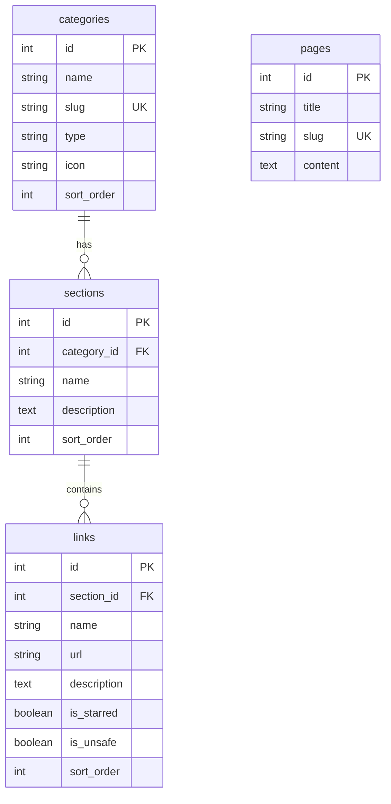

# 🌐 FMHY HUB

A premium, high-performance, self-bootstrapping PHP, HTML, and MySQL implementation of the famous [FMHY (Free Media Heck Yeah)](https://fmhy.net/) wiki content database.

This project transforms the official VitePress markdown files into a responsive, premium web interface with a relational database backbone, enabling instant dynamic search, glassmorphism layouts, and automatic database updates.

---

## ⚡ Features

- **🚀 Live Autocomplete AJAX Search:** Instant client-side filtering and database query matching across links, descriptions, tags, and categories.
- **✨ Premium UI/UX:** Responsive glassmorphism sidebar navigation, harmonious tailored color schemes for dark/light modes, micro-animations, and subtle glow effects.
- **🛠️ Self-Bootstrapping Database:** The backend automatically creates the required tables on the fly if the database is missing or empty.
- **📂 Bulk Markdown Parser:** A command-line/browser-accessible PHP script (`import.php`) that parses standard VitePress markdown structure and inserts them into categories, sections, and links.
- **🔓 Base64 Decoder Popups:** Support for decoding encoded URLs directly within the search and list interface.
- **📁 Subdirectory Routing & Cache Buster:** Seamlessly runs inside local XAMPP subfolders (e.g. `/HUB/`) by using URL-relative SPA routing and automatic PHP `filemtime()` script/style versioning to prevent browser cache issues.

---

## 🛠️ Technology Stack

- **Backend:** PHP 8+ (using PDO for secure, prepared MySQL statements)
- **Database:** MySQL / MariaDB
- **Frontend:** HTML5, Vanilla JavaScript, and custom Vanilla CSS (CSS variables, Flexbox/Grid, transitions)
- **Icons:** Unicode Emojis & CSS styles

---

## 💾 Database Schema

The system uses a clean relational structure to organize pages, sections, and links:



---

## 🚀 Local Installation (XAMPP Setup)

To run **FMHY HUB** locally on your Windows machine using XAMPP:

### 1. Place the files in htdocs
Clone or copy this repository into your XAMPP directory:
```bash
C:\xampp\htdocs\HUB
```

### 2. Start XAMPP Services
Open the **XAMPP Control Panel** and start:
- **Apache** (Web Server)
- **MySQL** (Database Server)

### 3. Initialize/Import Database Content
You don't need to manually create any tables. The setup script will bootstrap everything. Run the importer script from your command line to parse the markdown files and populate the database:
```bash
# Execute via PHP CLI
C:\xampp\php\php.exe C:\xampp\htdocs\HUB\import.php
```
*Alternatively, you can navigate to `http://localhost/HUB/import.php` in your web browser to initialize the import.*

### 4. Access the Website
Open your browser and visit:
👉 **[http://localhost/HUB](http://localhost/HUB)**

---

## 📂 Project Directory Structure

```text
C:\xampp\htdocs\HUB\
├── docs/                # Source markdown (.md) files cloned from upstream
│   ├── ai.md
│   ├── video.md
│   ├── audio.md
│   └── other/
├── public/              # Static assets (images, icons)
├── app.js               # Frontend routing, search filter, decoder, theme toggling
├── db.php               # PDO database connection & schema bootstrapping helper
├── import.php           # Markdown parser and database populator
├── index.php            # Main single-page-feel interface shell
├── schema.sql           # Database schema definition
├── search.php           # AJAX endpoint for search queries
└── style.css            # Custom premium dark/light stylesheet
```

---

## 🔄 Fetching Latest FMHY Updates

To fetch the latest links and updates from the official wiki and update your local database:

1. Clone or download the latest markdown files from the official repository: [fmhy/edit](https://github.com/fmhy/edit)
2. Replace all markdown files inside the `docs/` folder of this project with the new ones.
3. Run the database importer:
   ```bash
   C:\xampp\php\php.exe C:\xampp\htdocs\HUB\import.php
   ```
4. Done! The database will be rebuilt and refreshed with the updated counts.
